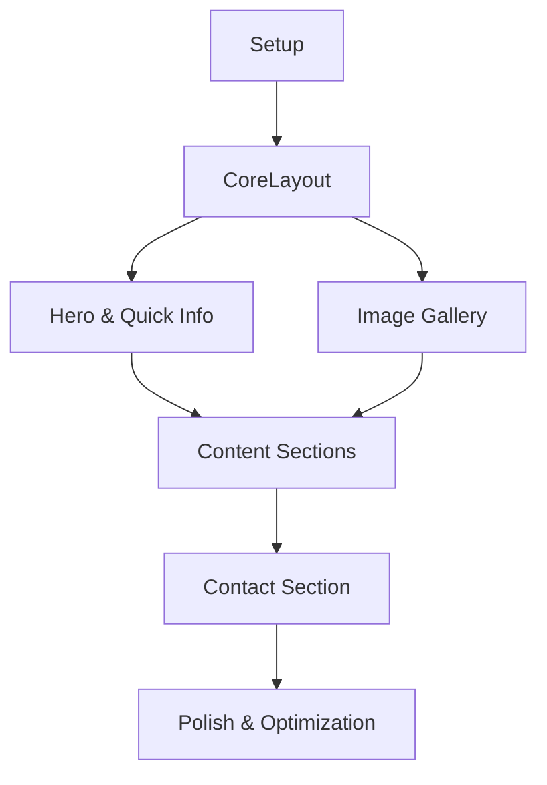

# Implementation Tasks

## Overview
Feature: Flat Sublet Advertisement Website
Type: Static HTML/CSS Website
Tech Stack: HTML, Tailwind CSS

## Tasks by Phase

### Phase 1: Setup
- [ ] T001 Create root project folder structure
- [ ] T002 Initialize package.json with npm init
- [ ] T003 Install Tailwind CSS dependency
- [ ] T004 Create tailwind.config.js configuration file
- [ ] T005 [P] Create initial CSS source file at css/styles.css
- [ ] T006 [P] Add build scripts to package.json for Tailwind compilation

### Phase 2: Core Layout Foundation
- [ ] T007 Create base index.html with HTML5 structure
- [ ] T008 Set up meta tags and SEO elements in index.html
- [ ] T009 Configure viewport and responsive settings in index.html
- [ ] T010 Create CSS Grid layout containers in index.html
- [ ] T011 [P] Add Tailwind base styles to css/styles.css

### Phase 3: Hero and Quick Info [US1]
- [ ] T012 [P] [US1] Create hero section markup in index.html
- [ ] T013 [P] [US1] Add quick info section with key apartment details in index.html
- [ ] T014 [US1] Implement responsive hero layout in css/styles.css
- [ ] T015 [US1] Style quick info cards in css/styles.css

### Phase 4: Image Gallery [US2]
- [ ] T016 [P] [US2] Create floor plan section in index.html
- [ ] T017 [P] [US2] Set up image gallery grid structure in index.html
- [ ] T018 [US2] Implement gallery CSS Grid layout in css/styles.css
- [ ] T019 [P] [US2] Add image optimization for living room photos (1.jpg, 2.jpg, 3.jpg, 4.jpg, 6.png)
- [ ] T020 [P] [US2] Add image optimization for balcony photo (5.jpg)
- [ ] T021 [P] [US2] Add image optimization for bedroom photos (7.jpg, 8.jpg, 9.jpg, 10.jpg)
- [ ] T022 [P] [US2] Add image optimization for bathroom photos (11.jpg, 12.jpg)
- [ ] T023 [P] [US2] Optimize floor plan image (plan.png)

### Phase 5: Content Sections [US3]
- [ ] T024 [P] [US3] Create features and amenities section in index.html
- [ ] T025 [P] [US3] Add location information section in index.html
- [ ] T026 [US3] Style features section in css/styles.css
- [ ] T027 [US3] Implement location section styling in css/styles.css

### Phase 6: Contact Section [US4]
- [ ] T028 [P] [US4] Create contact section structure in index.html
- [ ] T029 [P] [US4] Add email and phone number display in index.html
- [ ] T030 [P] [US4] Implement WhatsApp QR code display in index.html
- [ ] T031 [US4] Style contact section in css/styles.css

### Phase 7: Polish & Optimization
- [ ] T032 Implement lazy loading for all images in index.html
- [ ] T033 Add responsive image srcset attributes in index.html
- [ ] T034 [P] Add hover effects and transitions in css/styles.css
- [ ] T035 [P] Implement print styles in css/styles.css
- [ ] T036 Validate HTML using W3C validator
- [ ] T037 Test responsive layouts across devices
- [ ] T038 Verify performance metrics in Lighthouse

## Dependencies

## Parallel Execution Opportunities

### Setup Phase
- T005 and T006 can be done in parallel after T001-T004

### Content Implementation
- Image optimization tasks (T019-T023) can all be done in parallel
- Section creation tasks can be parallelized within their user story:
  - US1: T012 and T013 in parallel
  - US2: T016 and T017 in parallel
  - US3: T024 and T025 in parallel
  - US4: T028, T029, and T030 in parallel

### Styling
- CSS styling tasks can be done in parallel with their corresponding HTML implementation within each user story

## Implementation Strategy

### MVP (Minimum Viable Product)
- Complete through US2 (Hero, Quick Info, and Image Gallery)
- Basic responsive layout
- Essential image optimization
- Core contact information

### Incremental Delivery
1. Basic structure and layout (Phase 1, 2)
2. Hero and apartment overview (US1)
3. Image gallery and floor plan (US2)
4. Additional content sections (US3)
5. Contact section (US4)
6. Final polish and optimization

### Success Validation
Each user story can be tested independently:
- US1: Hero and quick info display correctly and are responsive
- US2: Gallery grid works and images load efficiently
- US3: Content sections are properly formatted and responsive
- US4: Contact information is accessible and properly displayed

Total Tasks: 38
- Setup: 6 tasks
- Core Layout: 5 tasks
- US1 (Hero & Quick Info): 4 tasks
- US2 (Image Gallery): 8 tasks
- US3 (Content Sections): 4 tasks
- US4 (Contact Section): 4 tasks
- Polish & Optimization: 7 tasks